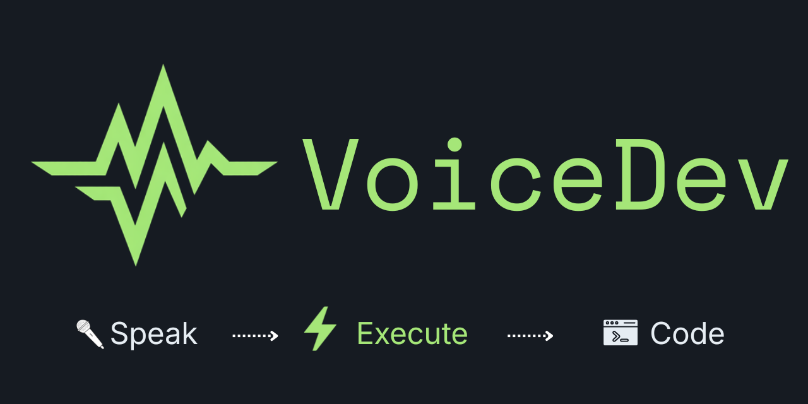

[](https://marketplace.visualstudio.com/items?itemName=mohitSharma74.voicedev)
[](https://opensource.org/licenses/BSD-3-Clause)
[](https://www.typescriptlang.org/)
[](https://code.visualstudio.com/)

# VoiceDev - Voice Control for VS Code

**Voice-activated commands for VS Code** - speak to code, commit, and control your editor.

> ⚠️ **v0.1.0-preview** - This extension is in early development.

## Why VoiceDev?

### Comparison with VS Code's Built-in Speech Extension

| Feature                | VoiceDev                            | VS Code Speech Extension        |
| ---------------------- | ----------------------------------- | ------------------------------- |
| **Voice Commands**     | ✅ Full VS Code command execution   | ❌ Limited to basic navigation  |
| **Voice Dictation**    | ✅ Text insertion at cursor         | ✅ Text insertion at cursor     |
| **Git Integration**    | ✅ Voice-to-commit messages         | ❌ No Git integration           |
| **Privacy Options**    | ✅ Cloud + Local offline mode       | ❌ Cloud-only                   |
| **Provider Choice**    | ✅ Groq, OpenAI, Local              | ❌ Single cloud provider        |
| **Setup Complexity**   | ⚠️ Local requires Python/ffmpeg     | ✅ Simple setup                 |
| **Performance**        | ⚡ Fast (cloud) / 🐌 Slower (local) | ✅ Consistent cloud performance |
| **Cost**               | 🆓 Free tier + 💰 Paid options      | 🆓 Free (cloud-based)           |
| **Offline Capability** | ✅ Full offline mode available      | ❌ Requires internet            |

**Choose VoiceDev if you need:** Advanced voice commands, Git integration, privacy-focused offline mode, or multiple provider options.

**Choose VS Code Speech if you want:** Simple voice dictation with minimal setup and consistent cloud performance.

## Features

VoiceDev brings voice control to your development workflow:

- 🗣️ **Voice Commands** - Execute VS Code actions by speaking
- 📝 **Voice Dictation** - Insert text at cursor via voice
- 🔧 **Git Integration** - Generate commit messages from voice descriptions

### ✨ NEW: Privacy-First Offline Mode Available!

Choose your speech-to-text provider:

| Provider              | Speed        | Cost         | Privacy          | Setup                   |
| --------------------- | ------------ | ------------ | ---------------- | ----------------------- |
| **Groq** (default)    | ⚡ Very Fast | 🆓 Free tier | ☁️ Cloud         | API key only            |
| **Voxtral (Mistral)** | ⚡ Very Fast | 🆓 Free tier | ☁️ Cloud         | API key only            |
| **Local**             | 🐌 Slower    | 🆓 Zero cost | 🔒 Fully offline | One-time setup (~2 min) |
| **OpenAI**            | 🐢 Medium    | 💰 Paid      | ☁️ Cloud         | API key only            |

**Privacy-first option**: Local provider keeps your voice on your machine - no data sent to cloud.

### Coming in v0.1.0

- Voice-activated commands (save, format, console.log, etc.)
- Voice-to-Git commits with Conventional Commits format
- Quick voice dictation with hotkey activation
- Status bar integration with recording feedback

## Requirements

- VS Code 1.85.0 or higher
- Microphone for voice input

### Cloud Providers (Default)

- **Groq API key** (free at [console.groq.com](https://console.groq.com)) - for fast cloud speech-to-text
- **OpenRouter API key** (optional) - for AI-powered commit messages

### Local Provider (Privacy-First Option)

- **Python 3.9-3.12** - must be in PATH
- **ffmpeg** - must be in PATH ([download here](https://ffmpeg.org/download.html))
- **Disk space**: ~150MB for model download (one-time)
- **RAM**: 4GB minimum, 8GB+ recommended

**Why choose local?** Your voice never leaves your machine. Zero API costs, unlimited usage, works offline.

## Installation

1. Install from VS Code Marketplace (coming soon)
2. Or install the `.vsix` file manually

## Quick Start

### Option A: Groq (Fast & Free - Recommended for Getting Started)

1. Get a free API key from [console.groq.com](https://console.groq.com)
2. Open Command Palette (`Cmd/Ctrl + Shift + P`)
3. Run `VoiceDev: Set API Key`, select "Groq", and paste your key
4. Press `Ctrl+Shift+V` to start recording
5. Speak a command like "save all" or dictate text

### Option B: Mistral (Fast & Free - Voxtral powered)

1. Get a free API key from [console.mistral.ai](https://console.mistral.ai)
2. Open VS Code Settings (`Cmd/Ctrl + ,`)
3. Search for "voicedev.stt.provider" and select "mistral"
4. Open Command Palette and run `VoiceDev: Set API Key`, select "Mistral"
5. Press `Ctrl+Shift+V` to start recording
6. Speak a command or dictate text

### Option C: Local (Private & Offline - Zero Cost)

1. Install Python 3.9-3.12 and ffmpeg (if not already installed)
2. Open VS Code Settings (`Cmd/Ctrl + ,`)
3. Search for "voicedev.stt.provider"
4. Select "local" from the dropdown
5. Press `Ctrl+Shift+V` to start recording (first run will setup environment ~2 min)
6. Your voice stays on your machine - no API keys, no cloud, no limits

## Configuration

Customize VoiceDev through your VS Code settings. Add these configurations to your `settings.json`:

### Basic Configuration

```json
{
	"voicedev.stt.provider": "groq",
	"voicedev.llm.provider": "openrouter",
	"voicedev.llm.model": "anthropic/claude-3-haiku-20240307",
	"voicedev.audio.feedbackSounds": true
}
```

### Configuration Options

| Setting                         | Description                   | Values                                       | Default                               |
| ------------------------------- | ----------------------------- | -------------------------------------------- | ------------------------------------- |
| `voicedev.stt.provider`         | Speech-to-text provider       | `"groq"`, `"mistral"`, `"openai"`, `"local"` | `"groq"`                              |
| `voicedev.llm.provider`         | AI model provider             | `"openrouter"`, `"openai"`                   | `"openrouter"`                        |
| `voicedev.llm.model`            | AI model for commit messages  | Model identifier string                      | `"anthropic/claude-3-haiku-20240307"` |
| `voicedev.audio.feedbackSounds` | Enable/disable audio feedback | `true`, `false`                              | `true`                                |

### How to Apply Configuration

1. Open VS Code Settings:
    - **Windows/Linux**: `Ctrl + ,`
    - **macOS**: `Cmd + ,`

2. Click the "Open Settings (JSON)" icon in the top-right corner

3. Add or modify the VoiceDev configuration section

4. Save the file - changes take effect immediately

### Provider-Specific Settings

#### Groq Provider

```json
{
	"voicedev.stt.provider": "groq"
}
```

**Note**: Use `VoiceDev: Set API Key` command to securely store your Groq API key.

#### Mistral Provider

```json
{
	"voicedev.stt.provider": "mistral"
}
```

**Note**: Use `VoiceDev: Set API Key` command to securely store your Mistral API key. Powered by Mistral's Voxtral-mini model for fast, accurate transcription.

#### Local Provider

```json
{
	"voicedev.stt.provider": "local",
	"voicedev.stt.local.pythonPath": "path-to-python-executable"
}
```

#### OpenAI Provider

```json
{
	"voicedev.stt.provider": "openai"
}
```

**Note**: Use `VoiceDev: Set API Key` command to securely store your OpenAI API key.

## For Developers

Interested in contributing to VoiceDev? Check out our [QUICKSTART.md](QUICKSTART.md) guide for detailed setup instructions, development workflow, and information about working with the local/offline speech-to-text provider.

**Quick links:**

- 📖 [Contribution Guidelines](CONTRIBUTING.md)
- 🐞 [Report Issues](https://github.com/mohitSharma74/voicedev/issues)
- 💬 [Discussions](https://github.com/mohitSharma74/voicedev/discussions)

### Reporting Issues

We welcome bug reports and feature requests from both technical contributors and non-technical users! When creating a new issue, you'll be guided through our structured templates:

- **🐛 Bug Report**: For reporting bugs and unexpected behavior
- **🚀 Feature Request**: For suggesting new features and improvements
- **💬 General Issue**: For questions, discussions, or other topics

**Tips for effective issue reporting:**

- Search existing issues before creating a new one
- Provide clear, step-by-step reproduction instructions for bugs
- Include version information (VoiceDev, VS Code, OS)
- Add screenshots or recordings when helpful
- Be specific about expected vs actual behavior

Our templates include sections for both non-technical users (basic information) and technical contributors (detailed logs, technical insights).

## Troubleshooting

### Local Provider Issues

**"Python 3.9+ is required to use Local STT"**

- Ensure Python 3.9-3.12 is installed and in your system PATH
- Run `python --version` in terminal to verify

**"ffmpeg not found in PATH"**

- Install ffmpeg from [ffmpeg.org](https://ffmpeg.org/download.html)
- On Windows: `choco install ffmpeg` (with Chocolatey)
- On macOS: `brew install ffmpeg`
- Verify with `ffmpeg -version`

**"Setup failed" or timeout during first run**

- Check your internet connection (downloads ~150MB model)
- Run `VoiceDev: Clear API Key` and try again
- Ensure enough disk space (~200MB total)

### Cloud Provider Issues

**"Invalid API key" or transcription fails**

- Verify your API key at [console.groq.com](https://console.groq.com)
- Run `VoiceDev: Set API Key` to update
- Check your internet connection

## Known Limitations

### Local Provider

- **Performance**: ~3-5x slower than cloud providers (runs on CPU)
- **First run**: One-time setup takes ~2 minutes + ~150MB download
- **Best for**: Short commands and dictation (under 30 seconds)
- **Accuracy**: Slightly lower with CPU int8 quantization vs full GPU models
- **Platform**: Windows fully supported; macOS/Linux support in progress

### All Providers

- Maximum recording length: 30 seconds (auto-stop)
- Requires clear audio input for best accuracy
- Background noise may affect transcription quality

## Roadmap

- **v0.1.0-preview** (Current):
    - ✅ Core voice commands and git integration
    - ✅ Multi-provider support (Groq, Mistral, OpenAI, Local)
    - ✅ Privacy-first offline mode with faster-whisper
    - ✅ Mistral Voxtral integration for fast cloud transcription
- **v0.2.0**: Code generation from voice
- **v0.3.0**: Custom voice commands and snippets
- **v1.0.0**: Production release with full cross-platform support

## Contributing

Contributions welcome! See [CONTRIBUTING.md](CONTRIBUTING.md) for guidelines.

## License

BSD 3-Clause License - See [LICENSE](LICENSE) file for details.

---

**Built for the GitHub Copilot CLI Challenge** 🚀
